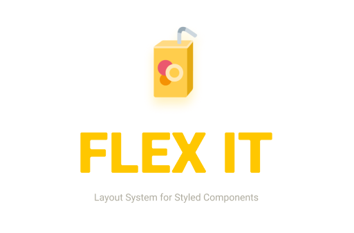

[](https://www.npmjs.com/package/react-flex-it) [](https://standardjs.com)

## About

Save a lot of repetitive work by using Flex It when building layouts for your project. Every element is automatically `display: flex` and there are shorthand syntax for setting `flex-direction` to row or column.

The code is also readable and easy to integrate into your current project.

## Dependencies

- `styled-components`

## Install

```bash
npm install --save react-flex-it
```

## Examples

### Basic layout
```jsx
import Flex from 'react-flex-it'

const MainLayout = () =>
  <Flex>
    <Flex.aside column>Sidebar</Flex>
    <Flex.main n='3' column>
      <header>
        <h1>Title</h1>
      <header>
      <Flex.article>
        Content
      </Flex.article>
    </Flex>
    <Flex.aside column>Sidebar</Flex>
  </Flex>
```

### Styling

```jsx
import Flex from 'react-flex-it'
import styled from 'styled-components'
const Main = styled(Flex.aside)`
  background-color: gray;
  border: 1px solid darkgray;
  box-sizing: border-box;
`
const NavUl = styled()`

`
const Layout = (props) =>
  <Main col>
    <header>Top</header>
    <nav>
    <Flex.ul maxWidth='320px'>
      <li>Home</li>
      <li>Something</li>
      <li>Cool</li>
    </Flex.ul>
    </nav>
    <Flex.main>Content</Flex.main>
    <footer>Bottom</footer>
  </Main>
```

### 3x3 grid centered
```jsx
import Flex from 'react-flex-it'
const Block = styled(Flex.figure)`
  align-items: center;
  justify-content: center;
`
// ...or
const BlockAlt = (props) => <Flex.figure ai='center' jc='center' {...props} />

const Three = () =>
  <Flex column>
    <Flex jc='center'>
      <Block>1.1</Block>
      <Block>1.2</Block>
      <Block>1.3</Block>
    </Flex>
    <Flex>
      <Block>2.1</Block>
      <Block>2.2</Block>
      <Block>2.3</Block>
    </Flex>
    <Flex>
      <Block>3.1</Block>
      <Block>3.2</Block>
      <Block>3.3</Block>
    </Flex>
  </Flex>
```

### Shorthand usage

```jsx
  <Flex ai='center' jc='center' r>
    <p>Centered text</p>
  </Flex>
```

- `r` for `row`
- `ai` for `align-items`
- `jc` for `justify-content`


## Game Plan

- [ ] Add props for responsive styling (breakpoints and flex order)
- [x] Extend flex objects

## License

MIT © [Sun Labs Nordic](https://github.com/sun-labs)
